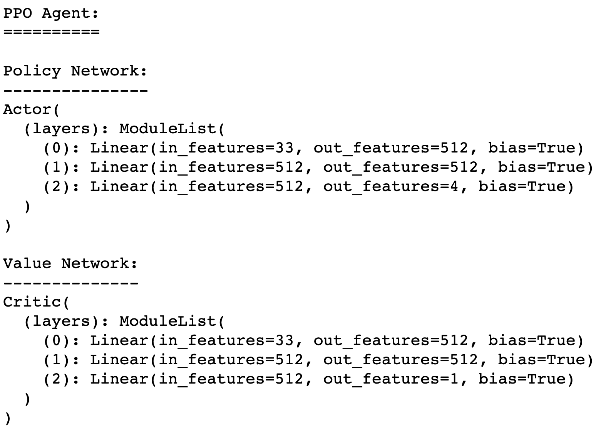

# Report: Reacher using Policy Gradient

## Learning Algorithm

What we're dealing with here is an envirornment with continuous observation space that consists of 33 variables corresponding to position, rotation, velocity, and angular velocities of the arm, and continues action space, a vector with 4 numbers, corresponding to torque applicable to two joints. Policy Gradient methods are the right fit for continuos action space.

I'll try to solve this environment with two PG algorithms, using the latest Actor-Critic methods:

- Advantage Actor Critic (a.k.a A2C). [A3C paper](https://arxiv.org/abs/1602.01783). Note A3C is the asyncronous version of A2C
- Proximal Policy Optimization or PPO. [Paper](https://arxiv.org/abs/1707.06347)

I'll be also computing advantages using λ-returns with Generalized Advantage Estimation or GAE. [Paper](https://arxiv.org/abs/1506.02438). Policy gradient, while unbiased, have high variance. This paper proposes ways to dramatically reduce variance, but this unfortunately comes at the cost of introducing bias. [Source](https://danieltakeshi.github.io/2017/04/02/notes-on-the-generalized-advantage-estimation-paper/)

### Hyperparameters

Following is a list of all the hyperparameters used and their values:

#### General params
- ```seed = 0```
- ```num_agents = 20```
- ```num_episodes = 1000```
- ```steps = 2000```, steps done per episode, until ```done=True```
- ```state_size = 33```
- ```action_size = 4```, vector of 4 values ranging between -1 and 1
- ```gamma = 0.99```, discount factor
- ```ent_weight = 0.01```, entropy coefficient for exploration
- ```val_loss_weight = 1```. This weight makes sense when using only one network with two heads for actor and critic, controlling how much weight the value loss has over the combined loss. Since I'm using two separate networks its value should be 1

We're gonna evaluate the environment after each episode just once. When we reach ```env_solved``` avarage score, then we'll run a full evaluation, that means, we're gonna evaluate ```times_solved``` times (this is required to solve the env) and avarage all the rewards
- ```env_solved = 30```
- ```times_solved = 100```

#### Actor (Policy network) params
- ```activ_actor = F.relu```
- ```lr_actor = 3e-4```
- ```hidden_actor = (512, 512)```, two hidden layers
- ```optim_actor = Adam```
- ```grad_clip_actor = 5```, will take care of clipping the gradients to address exploding/vanishing gradient problem.

#### Critic (Value network) params
- ```activ_critic = F.relu```
- ```lr_critic = 3e-4```
- ```hidden_critic = (512, 512)```
- ```optim_critic = Adam```
- ```grad_clip_critic = 5```

#### PPO hyperparams
- ```ppo_clip = 0.2```
- ```ppo_epochs = 10```, controls how many times we're gonna update the policy using mini-batches of previously collected trajectories
- ```ppo_batch_size = 32```

#### GAE
- ```use_gae = True```
- ```lamda = 0.95```, parameter to compute GAE

### Algorithms
**Advantage Actor Critic or A2C**:

Policy Based algorithms, such as Policy Gradient, try to find directly the optimal policy without using Q-values like in Value Based algorithms. The problem with Policy Based methods like REINFORCE, is that they tend to have high variance. One solution to reduce variance and increase stability is to substract a baseline to the cumulative reward. 

More efficient methods involved using a second network, Critic, which will estimate the value function, Q-value or state value (V value), helping the Actor with updating the policy distribution in the direction suggested by the Critic (such as with policy gradients).

Advantage Actor Critic comes from the idea of using the advantage, _A(s,a) = Q(s,a) - V(s)_, instead of Q-values. The set of equations below illustrates the classic variants of actor critic methods (with respect to REINFORCE):

<p align="center">
  
  <br />
  <sup><i>Image taken from CMU CS10703 lecture slides</i></sup>
</p>

There are a few very [interesting](https://towardsdatascience.com/understanding-actor-critic-methods-931b97b6df3f) [articles](https://sergioskar.github.io/Actor_critics/) explaining A2C (and A3C)

**Proximal Policy Optimization or PPO**:

The idea or main motivation behind PPO is to answer the question: how can we take the biggest possible improvement step on a policy using the data we currently have, without stepping so far that we accidentally cause performance collapse?. We want to avoid having too large policy updates. To do that, we use a ratio that will tells us the difference between our new and old policy and clip this ratio. By doing that will ensure that our policy update will not be too large. 

PPO introduces another innovation which is running x epochs of gradient ascent over mini-batches of previously collected trajectories. This will make updating the policy a lot more efficient. But this introduces an important issue. If we keep reusing old trajectories and updating our policy, at some point the new policy might become different enough from the old one, so that all the approximations we made could become invalid. This is addressed by clip the ratio between the new and old policy.

Follow [these](https://openai.com/blog/openai-baselines-ppo/) [links](https://spinningup.openai.com/en/latest/algorithms/ppo.html) for some [interesting](https://towardsdatascience.com/proximal-policy-optimization-ppo-with-sonic-the-hedgehog-2-and-3-c9c21dbed5e) [readings](https://medium.com/@jonathan_hui/rl-proximal-policy-optimization-ppo-explained-77f014ec3f12) about PPO.

### Neural Networks Architecture

1. **A2C**


2. **PPO**


**Notes about Actor network:**
We need to add, since it's not visible when printing the network, another learnable parameter, [_std_](https://github.com/jscriptcoder/Reacher-Continuous-Control/blob/master/agent/actor.py#L20), which holds the standard deviation value (sigma) of the probability distribution of a continuous action space.

In the forward pass, we use ReLU activation function. The last layer is [passed through](https://github.com/jscriptcoder/Reacher-Continuous-Control/blob/master/agent/actor.py#L35) a Tanh activation to get values between -1 and 1, which will output the mean of the probability distribution. Sigma is [passed through](https://github.com/jscriptcoder/Reacher-Continuous-Control/blob/master/agent/actor.py#L39) a [Softplus](https://sefiks.com/2017/08/11/softplus-as-a-neural-networks-activation-function/) function to get always positive values. These are used to calculate the [normal distribution](https://github.com/jscriptcoder/Reacher-Continuous-Control/blob/master/agent/actor.py#L41) for the continous action.

**Note about Critic network:**
We use ReLU activation function in all hidden layers. Last layer will just output our predicted value state, V(s).

## Plot of Rewards

1. **A2C**:

2. **PPO**:

## Ideas for Future Work
